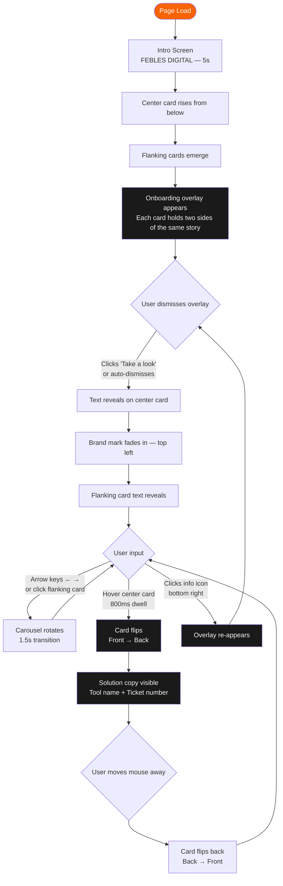

# Hero Faction Screen — System Diagram

```mermaid
flowchart TD
    A([Page Load]) --> B[Intro Screen\nFEBLES DIGITAL — 5s]
    B --> C[Center card rises from below]
    C --> D[Flanking cards emerge]
    D --> E[Onboarding overlay appears\nEach card holds two sides of the same story]

    E --> F{User dismisses overlay}
    F -->|Clicks 'Take a look'\nor auto-dismisses| G[Text reveals on center card]
    G --> H[Brand mark fades in — top left]
    H --> I[Flanking card text reveals]

    I --> J{User input}

    J -->|Arrow keys ← →\nor click flanking card| K[Carousel rotates\n1.5s transition]
    K --> J

    J -->|Hover center card\n800ms dwell| L[Card flips\nFront → Back]
    L --> M[Solution copy visible\nTool name + Ticket number]

    M --> N{User moves mouse away}
    N --> O[Card flips back\nBack → Front]
    O --> J

    J -->|Clicks info icon\nbottom right| P[Overlay re-appears]
    P --> F

    style A fill:#F96302,color:#fff
    style L fill:#1A1A1A,color:#F7F6F2
    style M fill:#1A1A1A,color:#F7F6F2
    style E fill:#1A1A1A,color:#F7F6F2
    style P fill:#1A1A1A,color:#F7F6F2
```
